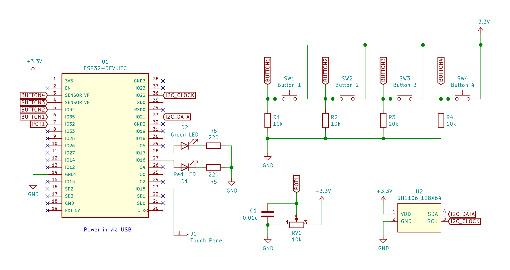
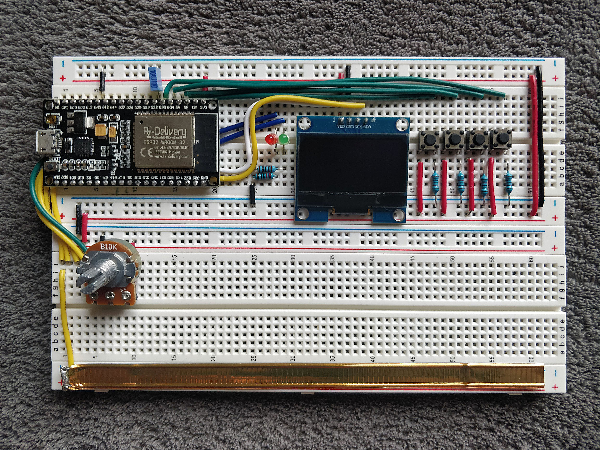

# Cube Timer

Cube Timer is a Bluetooth-enabled hardware twisty puzzle timer, based on the ESP32 MCU (using the [Arduino core](https://github.com/espressif/arduino-esp32))

### [Check out the demo](https://youtu.be/G7zfDGPaEZs) and [the blog post](https://ojdip.net/2020/11/esp32-cube-timer/)!

Features:
- Capacitive touch panel for starting and stopping the timer.
- 128x64 monochrome OLED display, so it can be used as a standalone device
- Bluetooth Low Energy interface for integration with results logging software
- Inspection mode with adjustable time
- Dedicated push buttons for +2/DNF
- I don't have any data to back it up, but it should be quite accurate, margin of error is ~2ms if the touch panel is properly calibrated.

Even though the software is Arduino-based, it is not very portable, as it makes use of some cool features of the ESP32 (e.g. capacitive sensor inputs, interrupts on all GPIO pins, Bluetooth radio). It might work with slight modifications on ESP8266, but it will definitely not work on AVR-based Arduino boards.
## Schematic and build



The dev board I used is [ESP32 DevKitC V2](https://docs.espressif.com/projects/esp-idf/en/latest/esp32/hw-reference/esp32/get-started-devkitc-v2.html). I used [this OLED module](https://www.az-delivery.de/en/products/1-3zoll-i2c-oled-display?variant=6571890737179), but any 128x64 SH1106 module should probably work just fine.

Touch panel can be wired to pretty much anything conductive, such as a square of aluminium foil. I used a resealable tab from a bag of coffee beans soldered to a jumper wire. Different panels will produce different readings, so Cube Timer has a built in calibration feature (long hold of button 4). Calibration values are persisted in flash across restarts.

Here's how it looks on a breadboard. The ESP32 dev board I used is too wide to fit on a regular-sized breadboard and leave holes on both sides, so I had to route half of the jumpers under the board.



## Bluetooth LE interface

Cube Timer exposes a BLE GATT service with the UUID of `EB0E77C3-AF14-4B7F-AC80-D3631DC386AC` and a single characteristic with UUID `EB0E77C3-AF14-4B7F-AC80-D3631DC386AD` (Read, Notify and Indicate).

It notifies on every internal state transition and the format corresponds to this packed struct:

```cpp
struct __attribute__ ((packed)) CharacteristicValue {
  // Internal state of the device 
  // (e.g. 0 = default, 10-19 = inspection, 20-29 = timer running)
  uint32_t state;    
  
  // Number that increments on every new solve
  uint32_t epoch;
  
  // Duration of the solve in milliseconds (DNF is represented as -1)
  int32_t duration;  
};
```

## Demo app

A simple demo app Web Bluetooth API is available on https://tibordp.github.io/cube-timer (see source under [demo_app](./demo_app))

## Ideas for further work

- Integrate it with [cstimer](https://cstimer.net/) or some other popular timer
- Add rechargeable battery and make use of ESP32's ULP coprocessor
- Some sort of persistence and statistics calculation, so it can function better as a standalone device
- Actually design a PCB for it (I have no idea yet how to do it, this is my first real electronics project)
- Ditch Arduino and [rewrite it in Rust](https://github.com/MabezDev/rust-xtensa)?